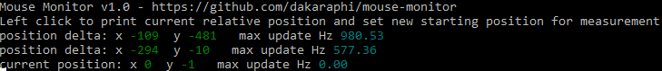

# Mouse Monitor
Mouse Monitor is useful for precisely setting mouse sensitivity values across games in Windows

- Mouse Monitor reads the Raw Mouse Input data to get the precise movement of your mouse
- Using this method, we do not need to know the DPI of the mouse or FOV of the game or use any calculations to match sensitivity across games

## How to use
### Basic use
1. [Download](https://github.com/dakaraphi/mouse-monitor/releases) or locally build using [Golang](https://golang.org/)
1. Run `mouse-monitor.exe` in a Windows Command Prompt window
1. Left click to set starting position for measurement
1. Left click again to print to the console the relative position compared to previous left click
1. The printed `position delta` is the value you will attempt to synchronize across games

### How to use for setting mouse sensitivity
There are 2 methods for matching mouse sensivity.  You will need to choose one of the following.
1. Aiming:  This will match the feel of mouse movement for aiming at targets visually onscreen.
2. 360 Movement:  This will match the feel for rotating in the game.

It might seem that these should be the same, but due to games having different FOV, they may be different.
If the games have the same FOV, then either method will have the same result.  Generally, most people are interested in matching the feel for aiming and would choose this option.

### Synchronizing game mouse sensitivity for aiming
1. Use `Mouse Monitor` to measure the distance between center of the screen and the edge
    1. Find a visual reference in the game and position so it marks the edge of the screen
    1. Left click.  This will set the starting point for our measurement
    1. Move the aiming cursor to the visual reference marking the edge so that it is now centered on the screen
    1. Left click.  This will record the delta position in the console.
1. Using the `delta position` discovered in previous step
    1. Launch another game
    1. Measure the `delta position`
    1. Adjust the game mouse sensivity until the `delta position` measurement matches the previous game.

### Synchronizing game mouse sensitivity for 360 movement
1. Use `Mouse Monitor` to measure the distance to rotate 360 degrees
    1. Find a visual reference in the game and position so it is centered under the aiming cursor
    1. Left click.  This will set the starting point for our measurement
    1. Rotate 360 degrees and center aiming cursor directy on the visual reference
    1. Left click.  This will record the delta position in the console.
1. Using the `delta position` discovered in previous step
    1. Launch another game
    1. Measure the `delta position`
    1. Adjust the game mouse sensivity until the `delta position` measurement matches the previous game.

### Estimating new sensitivity by calculation
You may be able to avoid several rounds of tweaking your sense by using this calculation

New Sense Value = `new delta` / `current delta` * `current sense value`

- `new delta` - This is the mouse movement distance you want to match from another game
- `current delta` - This is the current mouse movement distance of the game you are changing
- `curent sense value` - The current sensitivity value of the game you are changing

### Measuring mouse polling Hz
1. Mouse Monitor also reports on the polling frequency in Hz of your mouse
    1.  Move your mouse around continuosly for about 5 secs to get the approximate polling Hz of the mouse

### Calculating FOV for a game
Some games do not state the FOV; however, you can easily calculate using mouse monitor.

FOV = (`center to edge delta` * 2) / `360 delta` * 360

- `center to edge delta` - measure the distance from screen center to edge
- `360 delta` - measure the distance to rotate 360 degrees

